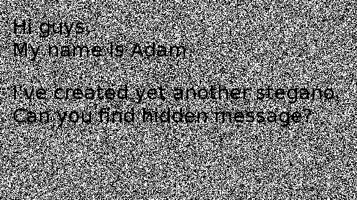
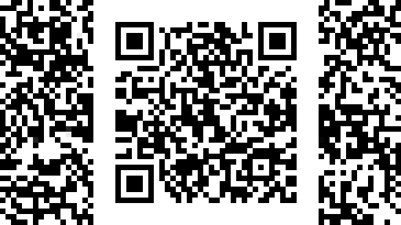

# [予選: SECCON CTF](https://ke1ju.github.io/ctf/2019/201910-seccon.html)

2019/10/19(土) 15:00 ～ 10/20(日) 15:00

https://score-quals.seccon.jp/
結果：5問回答 545ポイント 127位/779チーム

## write-up list
[Sandstorm](# Sandstorm)

## Sandstorm

Category|Misc
Points|279
Solve|62

I've received a letter... Uh, Mr. Smith?



画像中には以下の文字列が。
```
Hi guys.
My name is Adam.

I've created yet another stegano.
Can you find hidden message?
```

画像のExif情報を確認。
```
$ exiftool sandstorm.png 
ExifTool Version Number         : 11.01
File Name                       : sandstorm.png
Directory                       : .
File Size                       : 62 kB
File Modification Date/Time     : 2019:10:19 17:23:08+09:00
File Access Date/Time           : 2019:10:19 17:32:28+09:00
File Inode Change Date/Time     : 2019:10:19 17:26:36+09:00
File Permissions                : rw-r--r--
File Type                       : PNG
File Type Extension             : png
MIME Type                       : image/png
Image Width                     : 584
Image Height                    : 328
Bit Depth                       : 8
Color Type                      : RGB with Alpha
Compression                     : Deflate/Inflate
Filter                          : Adaptive
Interlace                       : Adam7 Interlace
Background Color                : 255 255 255
Image Size                      : 584x328
Megapixels                      : 0.192
```
一通りPNGのステガノツールを試したものの、うまく見つけらず。
本文の「Adam」とInterlaceの「Adam7 Interlace」で、Interlace途中に隠してあったりするのかなと思い、Interlaceに分割する方法を確認。
[こちら](https://blog.awm.jp/2016/01/26/png/)を参考にコマンドで簡単にできるImageMagicで画像を展開したところ、QRコードが。
```
$ convert  sandstorm.png -filter Point -fx "p{i-i%8,j-j%8}" sandstorm-1.png
$ convert  sandstorm.png -filter Point -fx "p{i-i%4,j-j%4}" sandstorm-2.png
$ convert  sandstorm.png -filter Point -fx "p{i-i%2,j-j%2}" sandstorm-3.png
```


QRコードの中身がFLAG。

FLAG：SECCON{p0nlMpzlCQ5AHol6}

***


